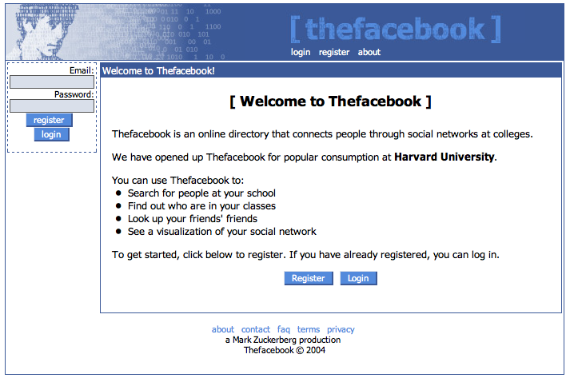

# Keep It Simple

- [slides](https://github.com/DPI-WE/slides-keep-it-simple)
- [video](https://youtu.be/DkOPuO1j_9M)

## Lesson Overview
This lesson focuses on the importance of simplicity in software development, encouraging trainees to build Minimum Viable Products (MVPs) that address the fundamental needs of users.

### Learning Objectives
By the end of this lesson, participants will be able to:
1. Understand the concept of MVPs and their significance in software development.
2. Identify key questions to consider when building a product.
3. Formulate hypotheses based on user needs and test them.
4. Analyze famous MVPs from well-known startups to draw insights.

## Introduction
> "Everything should be made as simple as possible, but not simpler."  
— **Albert Einstein**

Simplicity is key when developing software. The first step towards creating a successful product is eliminating unknowns through small, experimental proofs of concept.

## Key Questions to Consider

1. **Where is the required information coming from?**
   - Are our users supplying it?
   - Is it available from an API?
   - Can we download data (e.g., CSV from government websites)?
   - Can we scrape a website for data?

2. **Is our domain model correct?**
   - Have we identified all the information we need to solve the problem?
   - Is our database architecture correct?

3. **Are we solving the right problem?**
   - Is there a more pressing adjacent problem?

4. **Who is your user?**
   - Can we develop some key personas?

<!-- **Activity:** Brainstorm and discuss as a group how these questions can guide the initial stages of a product idea. -->

## Developing and Testing a Hypothesis

- What assumptions are we making about our users?
- How can we test these assumptions quickly?
- Formulate clear hypotheses about your project's key features and validate them.

**Example Hypothesis:** Suppose you're building a web application aimed at helping people find local volunteering opportunities. A hypothesis could be, "Users prefer to search for volunteering opportunities by skill set rather than location."

## Simplifying the Development Process

- Keep it simple! Avoid complicating the codebase by planning six months' worth of features ahead.
- What's the smallest thing you can build right now to test one hypothesis?
- Collaborate with peers to select an idea (hopefully from many options) and scope it down to a good initial feature set in a functional specification.

## Famous MVPs: Learning from the Best

Explore the initial launches of famous startups and analyze their MVPs:

### Airbnb 
Started as a simple webpage showcasing available rooms during a convention.

### Twitter
Originated as an internal tool at Odeo for employees to send messages.

### Gmail
Began as a personal email tool for a single user (because he hated microsoft outlook so much he built his own email client) before being shared with coworkers.

### Facebook
Initially a social platform only for Harvard students, built from components of prior projects.

### Instagram
Evolved from a complex app with many features to a simple photo-sharing platform after getting data and user feedback.

### Amazon
Launched as a platform selling only books.

### Dropbox
Conceptualized to solve a personal problem of forgetting a USB drive.

<!-- **Activity:** Review each MVP and discuss as a group what features were essential in the initial product and how they evolved. -->

## Summary

1. Start with a simple idea 💡.
2. Build a prototype 👷.
3. Launch it 🚀.
4. Listen to users 👂.
5. Iterate based on feedback 🔁.

## Resources
- [How Startups Beat Incumbents](https://longform.asmartbear.com/startup-beats-incumbent)
- [Elon's 5-Step Engineering Design Process](https://gist.github.com/heratyian/5b11e955c557382c9c14909af827f3b7)

## Quiz Questions

- What is the primary goal of building a Minimum Viable Product (MVP)?
- To create a fully-featured product.
  - Not quite.
- To validate assumptions and gather user feedback.
  - Correct!
- To launch as quickly as possible without consideration.
  - Not quite.
{: .choose_best #mvp_goal title="Primary Goal of MVP" points="1" answer="2" }

- Which of the following is NOT an important question to consider when developing a product?
- Where is the required information coming from?
  - Not quite.
- Is our database architecture correct?
  - Not quite.
- What color should the logo be?
  - Correct!
{: .choose_best #not_a_question title="Not a Question to Consider" points="1" answer="3" }

- Why is it important to keep the initial product simple?
- To save time and resources.
  - Correct!
- To focus on solving a specific problem for a user.
  - Correct!
- To gather valuable feedback that can shape future iterations.
  - Correct!
{: .choose_all #importance_of_simplicity title="Importance of Simplicity" points="1" answer="[1,2,3]" }

---

- Approximately how long (in minutes) did this lesson take you to complete?
{: .free_text_number #time_taken title="Time taken" points="1" answer="any" }
